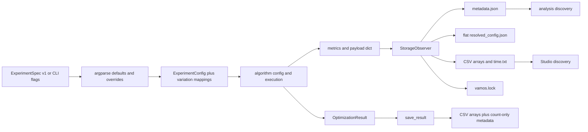
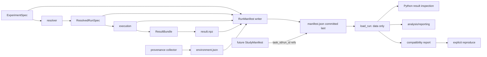
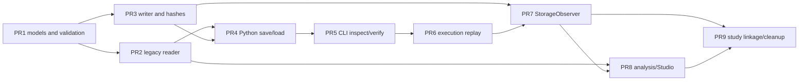

# Run artifact, persistence, and replay contract

Status: **normative v1 design, frozen for implementation**

Manifest identity: `vamos.run-manifest`

Manifest schema version: `1.0.0`

Decision record: [ADR 0006](adr/0006-run-artifact-and-replay-contract.md)

Acceptance specification: [Run artifact acceptance tests](run_artifact_acceptance_tests.md)

This document defines the durable boundary between one VAMOS execution and all
future consumers of that execution. Normative words such as **MUST**, **MUST
NOT**, **SHOULD**, and **MAY** have their usual RFC 2119 meanings.

## Goals

The contract MUST make one completed, failed, cancelled, or partial execution:

- versioned and recognizable without relying on its directory name;
- relocatable as a self-contained run directory;
- safe to inspect without importing or executing user code;
- losslessly loadable for every stored numerical value;
- auditable from user intent through resolved execution choices;
- integrity-checkable at both manifest and referenced-artifact level;
- replayable with an explicit, evidence-based guarantee;
- readable by Python, the CLI, studies, analysis, reporting, and migration tools;
- compatible with deterministic recognition of current VAMOS run directories.

The basic user MUST NOT need to understand the manifest to save, load, inspect,
verify, or replay a run. Scientifically material choices MUST remain explicit in
the manifest and in inspection output.

## Non-goals

This design does not implement the models, writer, reader, CLI, study resume,
retry policy, Studio sandbox, agent-documentation consolidation, registry
refactoring, or any numerical change. It does not define a complete
`StudyManifest`; it defines only the run-level linkage that a future study
contract may rely on. It does not make arbitrary Python serializable, promise
bitwise equality across backends, or use pickle as a scientific artifact
format.

## Evidence from the current repository

The contract is based on the implementation at
`d8f950dcd9ca43f9f679194d579ffb9a85e2d5f0`, rechecked in an isolated worktree.
A small ZDT1/NSGA-II CLI run produced `FUN.csv`, `X.csv`, `metadata.json`,
`resolved_config.json`, `time.txt`, and `vamos.lock`.

The following boundary failures were reproduced without changing production
code:

| Operation | Result | Architectural implication |
|---|---:|---|
| Small CLI run | exit 0 | Execution and current observer persistence work. |
| `vamos --config <emitted resolved_config.json>` | exit 2 | The emitted flat document is not an `ExperimentSpec`; it is rejected for unknown top-level keys. |
| Published cookbook replay | exit 1, `KeyError: 'pop_size'` | The recipe expects `pop_size`; CLI storage emits `population_size`. |
| `save_result(OptimizationResult, path)` | exit 0 | Only `FUN.csv`, `X.csv`, `n_solutions`, and `n_objectives` survive. |
| Search for paired public load/replay | none found | Loading stored arrays and executing replay have no symmetric public contract. |

The current CLI metadata contains useful provenance, operator configuration,
metrics, and backend capabilities, but those facts are split across files and
use a different shape from `OptimizationResult.meta`. Analysis discovers runs
by `metadata.json`; Studio discovers them by `FUN.csv` and also looks for the
obsolete `VAR.csv`; study persistence mirrors only a subset. These are inputs
to the compatibility design, not separate future sources of truth.

### Current data flow



There is no edge that round-trips the complete resolved run through a single
reader, and there is no authoritative conflict rule among the duplicated
representations.

## Frozen conceptual model

### Concept ownership

| Concept | Responsibility | Owns | Explicitly does not own |
|---|---|---|---|
| `ExperimentSpec` | User intent before full resolution | requested problem/algorithm/backend, requested seeds and budget, user overrides, labels | inferred defaults, selected plugin version, actual backend capabilities, results |
| `ResolvedRunSpec` | Complete deterministic configuration selected for one attempt | normalized component descriptors, algorithm/operator parameters, problem dimensions, termination, seed, backend/evaluation strategy, default-resolution evidence | timestamps, source/environment provenance, numerical arrays |
| `RunManifest` | Versioned envelope and sole run-level index | identity, schema, status, both specs, provenance summary, replayability, artifact inventory, integrity, failure, study linkage | large numerical arrays, arbitrary executable objects |
| `ResultBundle` | Safe numerical result | `F`, optional `X/G/CV`, optional population/archive arrays, array metadata, result counters | executable components, environment, user intent |
| `StudyManifest` | Future collection/attempt coordination | stable `task_id` to one or more `run_id` values and statuses | copied run configuration, copied arrays, run-level provenance |
| `CompatibilityReport` | Generated comparison view | integrity result, environment/component differences, effective replay level, required user actions | authoritative stored state or silent mutation of a run |

`Provenance` and `CompatibilityReport` are independent models. Provenance is a
stored, immutable description of the original attempt. A compatibility report
is generated for a particular inspection or replay environment and MUST NOT
rewrite provenance.

### Target data flow



### Source-of-truth rules

1. `manifest.json` is the authoritative index and status document.
2. `manifest.requested_spec` retains normalized user intent independently from
   `manifest.resolved_spec`.
3. `manifest.resolved_spec` is the canonical source of truth for replay. CLI
   flags, old `resolved_config.json`, CSV columns, directory names, and
   `OptimizationResult.meta` MUST NOT override it.
4. `result.npz` is authoritative for numerical values, shapes, and dtypes. CSV
   exports are views.
5. `environment.json` is authoritative for the captured dependency/environment
   snapshot. The manifest contains only the summary needed for discovery and
   the hashed reference.
6. A disagreement between authoritative and duplicated summary fields is a
   validation error, not a precedence opportunity. A reader MUST identify both
   conflicting locations.
7. Directory names are presentation only. They MUST NOT supply missing v1
   manifest fields.
8. Derived values include `task_id`, artifact verification state, array counts,
   objective/variable counts, and wall-clock duration from timestamps. If a
   derived value is cached, the reader MUST recompute and validate it.

Consumers read the same manifest: `load_run`, `load_result`, `reproduce`, CLI
inspection/verification, study linkage, analysis, reporting, and migration
tools. A consumer MAY load fewer artifact roles, but MUST NOT invent another
run schema.

## Identity and versioning

### Document identity

Every v1 manifest MUST contain:

```json
{
  "document_type": "vamos.run-manifest",
  "schema_version": "1.0.0"
}
```

The strings are independent from the VAMOS package version, Git revision, and
`ExperimentSpec.version`. Schema versions use `MAJOR.MINOR.PATCH`:

- a higher unsupported major version MUST be rejected before artifact access;
- a higher minor version within major 1 MAY be read only if all required v1
  semantics are understood; unknown fields are retained;
- patch versions clarify validation without changing field meaning;
- known migrations run in memory, are forward-only and idempotent;
- loading or migrating MUST NOT rewrite the original directory;
- writing a migrated artifact requires an explicit destination; a default
  migration writes a sibling directory and preserves the legacy source;
- migration need not be reversible because the original remains untouched.

The current directory layouts have no schema identity and are named
`legacy-cli-v0` and `legacy-python-save-v0`. Calling either layout “v1” would
falsely imply the guarantees defined here.

Unknown JSON fields in a supported major version MUST be retained in the
in-memory representation and on an explicit read/write migration. Unknown
artifact roles MUST be retained as metadata but MUST NOT be opened
automatically. Unknown required enum values, duplicate singleton artifact
roles, and missing required fields are errors. Validation messages MUST include
the JSON path, received value, expected constraint, and safe next action.

### Run identity

V1 uses two identities:

| Field | Construction | Meaning |
|---|---|---|
| `task_id` | `sha256:` plus the SHA-256 of canonical `ResolvedRunSpec`, excluding output paths, labels, timestamps, attempt lineage, and provenance | Stable scientific/runtime configuration, including seed and all selected components |
| `run_id` | lowercase UUIDv4 generated once when an attempt starts | Unique execution attempt |

The same configuration deliberately repeated has the same `task_id` and a new
`run_id`. `retry_of_run_id` links a retry to an earlier attempt. Different
source/environment provenance retains the same `task_id` but produces a new
attempt and a compatibility difference. A user-provided `name` or `labels` is
not an identity. UUIDv4 is chosen because it is in the Python standard library,
does not leak timestamps or host identifiers, and avoids a new dependency.

## Normative directory and files

```text
run-<run_id>/
├── manifest.json          # required; authoritative envelope
├── result.npz             # required for succeeded and result-bearing partial runs
├── environment.json       # required once environment capture succeeds
├── metrics.json           # optional extended metric series/details
├── events.jsonl           # optional append-only progress/events
├── FUN.csv                # optional compatibility view
├── X.csv                  # optional compatibility view
└── G.csv                  # optional compatibility view
```

| File | Role | Requirement | Authority |
|---|---|---|---|
| `manifest.json` | `manifest` | Always required once an attempt is visible | Canonical run index, specs, status, provenance summary, replay policy |
| `result.npz` | `result_bundle` | Required for `succeeded`; optional for `partial`; absent for failures with no usable result | Canonical numerical values |
| `environment.json` | `environment` | Required unless capture failed before it could be written; omission requires a structured reason | Canonical environment/dependency snapshot |
| `metrics.json` | `metrics` | Optional | Canonical only for metric keys explicitly listed in its descriptor; duplicated core counters must match manifest |
| `events.jsonl` | `events` | Optional | Diagnostic history; never required to load final results |
| `FUN.csv`, `X.csv`, `G.csv` | `compatibility_export` | Optional but SHOULD remain enabled during the migration window | Non-authoritative generated views |

No separate `resolved_spec.json` is canonical in v1. User intent and resolved
state are compact, mutually constrained, and embedded in the manifest so that
a run cannot pair a manifest with the wrong execution specification. Large or
open-ended data remains outside the manifest.

### JSON encoding

Normative JSON files use UTF-8 without a BOM, LF line endings, string keys,
finite JSON numbers, and no duplicate object keys. Writers emit sorted keys and
a trailing LF. For hashes of JSON values rather than files, canonical JSON is
UTF-8 over recursively sorted keys with separators `,` and `:`, no insignificant
whitespace, JSON booleans/null, and no NaN or infinity. Unicode strings are
preserved as Unicode and normalized to NFC before canonical hashing; stored
display strings are not otherwise rewritten.

### Manifest field table

| JSON path | Req. | Type | Meaning/validation |
|---|:---:|---|---|
| `document_type` | yes | string | Exactly `vamos.run-manifest` |
| `schema_version` | yes | string | Exactly a supported semantic version; initial `1.0.0` |
| `run_id` | yes | UUID string | Unique attempt identity |
| `task_id` | yes | `sha256:<64 hex>` | Recomputed from canonical resolved spec |
| `retry_of_run_id` | no | UUID string/null | Previous attempt, never self-referential |
| `name` | no | string | User-facing label, not identity |
| `labels` | no | object of strings | Sanitized user labels; keys unique |
| `status` | yes | enum | `running`, `succeeded`, `failed`, `partial`, or `cancelled` |
| `timestamps.started_at` | yes | RFC 3339 UTC string | Start time with `Z` or explicit UTC offset |
| `timestamps.completed_at` | terminal | RFC 3339 UTC string | Required for terminal status; absent for running |
| `requested_spec` | yes | object | Normalized `ExperimentSpec` user intent; may include omitted/defaulted choices |
| `resolved_spec` | yes | object | Complete `ResolvedRunSpec`; replay authority |
| `outcome` | terminal | object | Counters, termination, runtime, result availability |
| `provenance` | yes | object | Implementation/source/entry point/environment summary |
| `replayability` | yes | object | Declared level, deterministic flag, reasons and requirements |
| `artifacts` | yes | array | Artifact descriptors; empty is valid for an early failed run |
| `integrity.manifest_sha256` | terminal | hex string | Self-hash over canonical manifest with this field omitted |
| `failure` | failed/partial | object | Safe structured failure; traceback optional and redacted |
| `study` | no | object | Future `study_id`, `task_id`, attempt number only |
| `extensions` | no | object | Namespaced extension data; no unnamespaced semantic overrides |

### `ResolvedRunSpec` field table

Every scientifically material effective choice MUST be present. A value MUST
not be marked resolved while still depending on a runtime default.

| JSON path | Req. | Meaning |
|---|:---:|---|
| `spec_version` | yes | `vamos.resolved-run-spec/1` |
| `problem` | yes | Component descriptor plus `n_var`, `n_obj`, encoding, constraint convention, constructor config |
| `algorithm` | yes | Component descriptor plus complete normalized algorithm config |
| `operators` | yes | Resolved initializer, selection, crossover, mutation, repair and other selected policies; inactive roles use `null` with a reason |
| `backend.kernel` | yes | Stable backend ID, version/capabilities requested, actual selected name |
| `backend.evaluation` | yes | Serial/multiprocessing/Dask descriptor, worker count and ordering/determinism policy |
| `termination` | yes | Stable criterion ID plus complete parameters and hard safety budget |
| `seed` | yes | Integer seed used for the attempt |
| `population` | yes | Effective initial, offspring, archive and reference-direction sizes |
| `reference_directions` | conditional | Generation method, partitions/count, normalization and optional hashed resource reference |
| `defaults_applied` | yes | JSON Pointer to each inferred value, resolver ID/version and reason |
| `determinism` | yes | Declared deterministic/nondeterministic aspects and RNG family |

Component descriptors follow the policy below. Resolved operator parameters use
JSON objects, never Python tuples. Probability expressions such as `"1/n"` MAY
be retained in `requested_spec`, but `resolved_spec` MUST also contain their
numeric value and the dimension used to resolve them.

### Provenance field table

| JSON path | Req. | Privacy/default policy |
|---|:---:|---|
| `implementation.vamos_version` | yes | Package version |
| `implementation.distribution` | yes | Distribution name and installed artifact hash when available |
| `source.git_sha` | no | Required for Git checkout; null with reason for wheel-only installs |
| `source.dirty` | yes | Boolean or `unknown`; never silently treated as clean |
| `source.diff_sha256` | dirty | Hash of normalized diff when obtainable; diff content is not stored by default |
| `source.tree_hash` | no | Clean source/distribution content fingerprint when available |
| `entry_point.kind` | yes | `python_api`, `cli`, `study`, or another registered stable value |
| `entry_point.command` | CLI | Argument vector with secrets redacted; no shell-expanded environment |
| `entry_point.python` | Python | Public callable and sanitized explicit arguments/config source |
| `environment_ref` | yes after capture | Artifact role/path for `environment.json` |
| `host.hostname` | no | Omitted by default; opt-in because it is personally identifying |
| `host.cpu/gpu` | no | Coarse model/capability only; opt-in detailed serial identifiers are forbidden |
| `timestamps` | yes | Also at top level for discovery; values must agree |

`environment.json` MUST record Python implementation/version, OS/version,
architecture, NumPy/SciPy, backend package/version/capabilities, BLAS vendor and
integer width where discoverable, thread-related variables from an explicit
allowlist (`OMP_NUM_THREADS`, `MKL_NUM_THREADS`, `OPENBLAS_NUM_THREADS`,
`NUMEXPR_NUM_THREADS`), locale/timezone, and a sorted installed-distribution
snapshot or a hashed lock reference. It MUST NOT record tokens, credentials,
the complete environment, arbitrary user paths, or unrelated personally
identifying data. Executable/source paths are display-only provenance and MUST
NOT be replay inputs.

### Artifact descriptor

Each item in `artifacts` contains:

| Field | Req. | Rule |
|---|:---:|---|
| `role` | yes | Stable role; singleton roles cannot repeat |
| `path` | yes | Normalized POSIX relative path inside the run directory |
| `media_type` | yes | Registered MIME-like type |
| `sha256` | yes | Lowercase 64-hex digest of exact stored bytes |
| `bytes` | yes | Non-negative byte length |
| `required_for` | yes | List from `load`, `inspect`, `verify`, `replay`, `analysis` |
| `canonical` | yes | `true` for authoritative artifacts, `false` for views |
| `array_contract` | NPZ | Optional cached keys/shapes/dtypes, always verified against file |

All referenced artifacts, including optional exports when present, are hashed.
The manifest is protected by `integrity.manifest_sha256`, computed over the
canonical manifest with that field omitted. V1 provides corruption detection,
not signer authenticity; a malicious party able to replace both data and
digests can forge an artifact. Digital signatures are a future additive
extension, not implied by a SHA-256 match.

## ResultBundle

`result.npz` is a NumPy ZIP archive loaded with `allow_pickle=False`. Object
dtypes and pickled members are forbidden. Entry names are stable, case
sensitive, and use `/` only for optional namespaces.

| Array/key | Req. | Shape/semantics |
|---|:---:|---|
| `F` | succeeded | `(n_solutions, n_obj)` objective values; numeric dtype preserved |
| `X` | no | `(n_solutions, n_var)` decision values; required when execution produced aligned decisions |
| `G` | no | `(n_solutions, n_constraints)` signed residuals, feasible when `G <= 0` |
| `CV` | no | `(n_solutions,)` non-negative aggregate constraint violation; convention declared in resolved spec |
| `population/F`, `population/X`, `population/G`, `population/CV` | no | Final population when distinct from public result |
| `archive/F`, `archive/X`, `archive/G`, `archive/CV` | no | Final external archive, aligned by row |
| `reference_directions` | no | Directions actually used if generated/loaded and material to replay |

All arrays MUST preserve shape, dtype byte order, and values. Scalar metrics,
evaluation count, generation count, termination reason, monotonic
`runtime_ms`, interruption state, and result-mode semantics live in
`manifest.outcome`; extended metric data MAY live in `metrics.json`. Counts
cached in the manifest MUST equal the arrays. `n_solutions`, `n_objectives`,
and `n_variables` are derived from shapes and MUST NOT override them.

A succeeded run MUST have a valid `F`, even if its shape is `(0, n_obj)`. A
failed run may omit `result.npz`. A `partial` run may contain a result bundle,
but `failure` and `outcome.usable_result` MUST explain what is and is not valid.

## Paths and relocation

Artifact paths are relative to the directory containing `manifest.json` and
are serialized with `/` separators. A writer MUST reject absolute paths,
Windows drive/UNC paths, empty segments, `.`/`..`, NUL, and paths whose resolved
target escapes the run root. Unicode path segments use NFC. A loader MUST check
containment after resolution and again at open time; symlinks, junctions, and
reparse points that escape the root are rejected. Platforms without a reliable
no-follow primitive MUST fail closed for a suspicious link.

The entire run directory may be moved or renamed without modification. Original
source/resource paths may be recorded as redacted provenance, never as required
artifact paths or automatic replay inputs. An intentionally external resource
requires an explicit trusted resolver and downgrades replayability; it is not a
normal v1 artifact reference.

Missing required artifacts are errors. The message MUST identify artifact role,
relative path, expected digest/length, observed missing state, and a safe action
such as restoring from the original run or running inspection without results.

## Integrity and verification

SHA-256 is the only required v1 hash algorithm. Verification modes are:

| Mode | Behavior |
|---|---|
| `manifest` | Parse with duplicate-key detection, validate schema/semantics, recompute manifest self-hash; do not open optional data |
| `required` | `manifest` plus byte length and SHA-256 for artifacts required by the requested operation |
| `all` | Verify every referenced artifact including compatibility exports |

`load_run` defaults to `required` for the requested lazy operation;
`--verify-only` defaults to `all`. CSV exports are never used to repair a
corrupted canonical result automatically. A migration tool may explicitly
rebuild views from a verified `result.npz`.

An integrity error MUST report: operation, role, path, expected bytes/hash,
actual bytes/hash or missing state, and the safe next action. Verification MUST
not silently fall back to a different file with a familiar name.

## Atomicity and status

V1 status values are intentionally limited:

| Status | Meaning | Result rule |
|---|---|---|
| `running` | Attempt started and has not reached a terminal transition | May have no result; no `completed_at` |
| `succeeded` | Intended termination completed and canonical result is durable | Valid `result.npz` required |
| `failed` | Execution could not complete | Result absent unless explicitly diagnostic; structured failure required |
| `partial` | Terminal attempt has an explicitly usable but incomplete result | Result optional; usability and omissions required |
| `cancelled` | Explicit external/user cancellation | Partial result only when declared usable |

`pending` belongs to a future StudyManifest task ledger, not to a run attempt.

Writers use temporary sibling files in the same directory/filesystem, flush
file contents where supported, atomically replace the destination, and flush
the directory where supported. The initial visible manifest is `running`.
Terminalization proceeds in this order:

1. write and verify each canonical artifact to `<name>.tmp-<run_id>`;
2. atomically replace each final artifact;
3. write optional compatibility views the same way;
4. construct the terminal manifest with final hashes and self-hash;
5. atomically replace `manifest.json` **last**.

An interruption can therefore leave a valid `running` manifest or unreferenced
temporary files, but cannot expose `succeeded` with incomplete referenced
artifacts. Readers ignore recognized temporary siblings. A stale running run is
not automatically relabeled; an explicit recovery operation may transition it
to `failed` or `partial` while preserving evidence.

## Safe loading and trust boundary

Normal loading and inspection MUST:

- parse data only;
- perform no arbitrary imports or dynamic code execution;
- never deserialize pickle/cloudpickle or object-dtype NumPy data;
- contact no network service and execute no shell command;
- validate every artifact path before opening it;
- avoid opening unknown artifact roles automatically;
- impose configurable limits on JSON depth/size, artifact count, ZIP member
  count, per-array bytes, total uncompressed bytes, and compression ratio;
- reject malformed ZIP/NPY headers, overlapping members, duplicate names,
  unexpected object dtypes, and arrays that exceed limits before allocation;
- treat module/qualified-name strings as inert data.

Default limits will be selected in implementation and MUST be finite,
documented, and overridable only explicitly by a trusted caller. Exceeding a
limit is a safe load error, not a request to retry with pickle.

Replay is a separate explicit operation. It may resolve code only after
integrity verification, compatibility evaluation, and any required trust
confirmation.

## Component descriptors and custom code

Each problem, algorithm, operator, backend, and termination component uses a
descriptor with `kind`, stable `component_id`, `provider`, JSON `config`, and a
`resolution` object. The policies are:

| Component kind | Stored identity | Load behavior | Replay behavior | Maximum declared level |
|---|---|---|---|---|
| Built-in registered | stable VAMOS ID and contract version | data only | resolve exact ID; no alias substitution | `exact` |
| External registered plugin | entry-point group/name, distribution/version/hash, module/qualified name, JSON config | no entry-point loading | explicit plugin resolution; identity/hash checked | `exact` when identical, otherwise `compatible` |
| Importable custom Python | distribution/module/qualified name, source hash, JSON constructor config, serialization protocol ID | strings remain inert | only with explicit custom-code trust and protocol validation | `exact` only with identical code/protocol/environment |
| Explicit custom serialization protocol | protocol ID/version plus JSON-safe state and code identity | protocol is not invoked while loading arrays | protocol invoked only during trusted replay | level depends on identity match |
| Lambda/closure/notebook-local callable | descriptive module/qualified name/source hash when available and reason | stored result remains loadable | never imported automatically; user must reconstruct | `manual` or `unavailable` |
| Missing plugin/custom code | stored descriptor | stored result remains loadable | no substitution | `unavailable` |

The default component serialization protocol is configuration-only JSON. It
MUST NOT embed executable Python. A future custom protocol must be explicitly
registered, versioned, bounded, and invoked only in trusted replay. A
non-serializable component still produces a valid artifact with a reason such
as `closure_has_no_stable_import_path`; it MUST NOT disappear from provenance.

Replay never silently replaces a missing problem, operator, algorithm, backend,
or plugin. Aliases recorded in user intent are resolved to stable IDs in the
resolved spec.

## Replay contract

### Declared and effective replayability

The manifest stores the level supportable from original evidence. Inspection
generates an effective level for the current environment. The effective level
can only stay the same or decrease.

| Level | Meaning | Execution policy |
|---|---|---|
| `exact` | Bitwise `F` and `X` are promised for a declared deterministic path with identical resolved spec, implementation, backend, material environment and code | Default replay may execute |
| `compatible` | Components resolve and execution is scientifically comparable, but bitwise equality is not promised | Requires explicit `accept_level="compatible"` |
| `best_effort` | Execution is possible but provenance or compatibility evidence is incomplete | Requires explicit `accept_level="best_effort"`; result labeled non-reproduction |
| `manual` | Stored data is valid but automatic reconstruction needs user-supplied code/config | No automatic execution until the user supplies and trusts the missing component |
| `unavailable` | Integrity, schema, component, or nondeterminism constraints prevent faithful replay | Execution refused |

Exact means array equality including shape/dtype/value for `F` and `X` where X
exists. Other arrays use the same contract when marked exact-comparable. It
does not mean runtime or timestamps match.

### Replay guarantee matrix

| Original/current condition | Effective ceiling | Required behavior |
|---|---|---|
| Same clean Git SHA or identical installed distribution hash; same resolved spec/backend/material environment; deterministic path | `exact` | Execute and compare exact arrays |
| Same package version but unverifiable source/distribution identity | `compatible` | Explain missing implementation fingerprint |
| Dirty source tree | `compatible` by default | Record dirty state and diff hash; exact only if an opt-in captured source snapshot is identical |
| Same Python implementation and patch version | no downgrade | Continue other checks |
| Different Python patch/minor | `compatible` | Structured mismatch; no bitwise claim |
| Same dependency and backend versions/capabilities | no downgrade | Continue other checks |
| Material dependency/version/capability difference | `compatible` or `best_effort` | Name each difference; policy table determines severity |
| Same platform, BLAS and thread configuration | no downgrade | Continue other checks |
| Different platform/BLAS/thread configuration | `compatible` | Explain numerical-order risk |
| Different backend | `compatible` ceiling | Refuse without explicit backend override and accepted downgrade |
| Different VAMOS version/Git SHA | `compatible` or `best_effort` | Never infer equivalence from API compatibility alone |
| Installed, identical plugin | level based on remaining checks | Resolve only during explicit replay |
| Missing plugin | `unavailable` | Load result; refuse replay with installation guidance |
| Stable custom code with identical hash and trusted protocol | level based on remaining checks | Require explicit custom-code trust |
| Lambda/closure/notebook-local code | `manual` | Describe reconstruction requirements |
| Parallel/nondeterministic execution without a deterministic contract | `compatible` or `best_effort` | Compare declared statistical/numerical tolerances; never claim exact |
| Corrupt required artifact or unknown major schema | `unavailable` | Refuse replay before component resolution |

### Environment compatibility matrix

| Dimension | Exact requirement | Compatible difference | Blocking/unavailable case |
|---|---|---|---|
| VAMOS implementation | identical clean source/distribution fingerprint | known different version with resolvable spec | unsupported schema/missing algorithm semantics |
| Python | same implementation and patch | supported different patch/minor | unsupported interpreter |
| NumPy/SciPy | identical material versions/build identity | supported version difference | missing required package |
| Kernel backend | same ID/version/capabilities | explicit supported backend/version change | missing required backend without override |
| Evaluation backend | same strategy, ordering, workers | explicit compatible worker/strategy change | required plugin/cluster unavailable |
| OS/architecture | same | supported different platform | unsupported binary/plugin |
| BLAS | same vendor/build/integer width | known alternative | unavailable required numerical library |
| Threads | same allowlisted values | explicit changed values | nondeterministic policy requiring unavailable setting |
| Components | same stable IDs/config/code hashes | version difference accepted by component contract | missing/ambiguous component |
| Source dirty state | clean, or identical captured snapshot | dirty hash differs/was not captured | required custom source unavailable |

A compatibility report contains original/current values, severity, evidence,
declared and effective level, and one or more safe next commands. It never
silently edits the manifest.

### Overrides and replay output

Any override creates a new `run_id`, retains the original `task_id` only if the
canonical resolved spec is unchanged, records `replay_of_run_id`, lists every
override, and recomputes effective replayability. Backend or scientific-config
changes produce a new `task_id` and are labeled a derived run, not an exact
replay. Replay output is always a new directory. Existing output directories
are never overwritten; collision requires a new path or explicit new generated
attempt directory.

If replay execution fails, the new attempt is durably recorded as `failed` and
references the source run. The original remains untouched.

## Public Python API

### Alternatives

| Pattern | Strength | Weakness | Decision |
|---|---|---|---|
| `save_result/load_result/reproduce` functions | discoverable, matches existing helper, easy typing | advanced manifest access needs another object | Keep as basic facade |
| `result.save()` and `OptimizationResult.load()` | object-oriented discoverability | conflates stored result with run/provenance and replay | Reject as canonical; optional convenience may delegate later |
| `load_run(...).result/.manifest/.reproduce()` | clean distinction and advanced access | one extra concept for beginners | Adopt as advanced canonical model |

Recommended future facade:

```python
import vamos

result = vamos.optimize(...)
stored = vamos.save_result(result, "runs/my-run")

loaded = vamos.load_result("runs/my-run")       # data only convenience
run = vamos.load_run("runs/my-run")             # manifest + lazy result
report = run.compatibility()

replay = vamos.reproduce(
    "runs/my-run",
    accept_level="exact",
    output="runs/my-run-replay",
)
```

The frozen semantics are:

- `save_result(result, path, *, requested_spec=None, labels=None) -> StoredRun`
  upgrades the existing call shape and returns the stored run. Existing callers
  that ignore the current `None` return remain source-compatible.
- `load_run(path, *, verify="required") -> StoredRun` parses data without code
  resolution. It exposes `manifest`, lazy `result`, `status`, and
  `compatibility()`.
- `load_result(path, *, verify="required") -> OptimizationResult` is the basic
  convenience. It errors actionably when the status has no usable result and
  attaches immutable manifest access through a documented result property or
  metadata view.
- `reproduce(path, *, output=None, accept_level="exact", backend=None,
  trust_custom_code=False) -> ReplayReport` is the only operation that executes
  optimization.

These functions should be exported from the top-level `vamos` facade when
implemented. `vamos.ux.api.save_result` remains an import-compatible alias
during migration. **Loading stored data is never replay.**

## Public CLI

Recommended commands:

```text
vamos results inspect RUN_DIR [--json] [--verify manifest|required|all]
vamos reproduce RUN_DIR --verify-only [--require-level LEVEL] [--json]
vamos reproduce RUN_DIR [--output DIR] [--accept-level LEVEL]
                       [--backend NAME] [--trust-custom-code]
```

`--verify-only` performs no optimization and no component imports. `--backend`
is an explicit override but still requires an accepted downgraded level when it
changes the recorded backend. Existing `--config` continues to accept only
`ExperimentSpec`; it MUST NOT accept a RunManifest or legacy flat resolved
config. The validation error should direct users to `vamos reproduce`.

| Exit | Meaning | Representative output/action |
|---:|---|---|
| 0 | Inspection/verification succeeded, or replay met explicitly accepted level | Print run ID, integrity, effective level, output path |
| 2 | CLI usage/argument error | Show valid command syntax |
| 3 | Missing/corrupt/path-unsafe artifact or malformed data | Identify role/path/hash and restore guidance |
| 4 | Unknown/unsupported schema or invalid manifest | Identify document type/version and supported migration path |
| 5 | Compatibility level below requested level | Print structured differences and required `--accept-level` if safe |
| 6 | Component unavailable or custom-code trust not granted | Name component/distribution and safe installation/trust action |
| 7 | Replay execution failed | New failed attempt path and failure summary |
| 8 | Output collision | Choose another path; no files overwritten |

A non-exact environment is not an integrity failure. Default verify-only exits
0 when data is intact and emits the effective level; `--require-level exact`
exits 5 if exact conditions are not met. Default execution requires `exact`.

### Error semantics

Public errors expose a structured category and a message containing:

1. failed operation;
2. artifact role/path or JSON field;
3. reason;
4. expected state;
5. safe corrective action.

The implementation should use typed errors such as
`ManifestValidationError`, `ArtifactIntegrityError`,
`UnsupportedSchemaError`, `ReplayCompatibilityError`,
`ComponentResolutionError`, and `OutputCollisionError`, all under a public
`RunArtifactError`. Messages MUST be useful without a traceback and machine
output MUST carry the same fields.

## Legacy compatibility

### Recognition order

1. `manifest.json` with `document_type=vamos.run-manifest`: validate by schema
   version; never fall back to legacy if invalid.
2. Current CLI directory: `metadata.json` with rich algorithm/problem/backend
   fields plus `resolved_config.json` and usually `FUN.csv`; classify
   `legacy-cli-v0`.
3. Current Python save: count-only `metadata.json` plus `FUN.csv`/optional
   `X.csv`; classify `legacy-python-save-v0`.
4. Anything ambiguous is rejected with the recognized signatures and a safe
   migration suggestion.

### Current artifact-to-target mapping

| Current artifact | Target classification | Mapping |
|---|---|---|
| `FUN.csv` | retained compatibility view; migration input | Import as canonical `F` only during explicit legacy migration; emit as derived CSV in v1 |
| `X.csv` | retained compatibility view; migration input | Import as `X`; preserve absence rather than fabricate |
| `G.csv` | retained compatibility view; migration input | Import as `G` with `g_lte_0` only when current problem metadata supports that convention; otherwise flag ambiguity |
| `ARCHIVE_*.csv` | retained compatibility views | Import to `archive/*`; preserve row alignment and absence |
| `metadata.json` rich CLI form | migrated | Map identity, problem, config, metrics, backend, environment, Git and timestamp field-by-field |
| flat `resolved_config.json` | replaced after deterministic migration | Map to `ResolvedRunSpec`; `population_size` maps to population/algorithm pop size; variation blocks map only for their selected algorithm |
| `time.txt` | deprecated view | Parse as `outcome.runtime_ms`; preserve raw file as legacy evidence if ambiguous |
| `vamos.lock` | migrated | Map package/platform/Python snapshot to `environment.json`; executable path remains non-operative provenance |
| Current Python count-only `metadata.json` | replaced | Counts are validated against arrays; no algorithm/seed/backend/source is invented |
| Current `save_result` directory | recognized legacy layout | Load arrays safely; replay level `unavailable` unless the caller separately supplies verified spec/provenance during explicit migration |
| Study result CSV | future StudyManifest input | Rows may reference migrated `run_id`; never copied into a RunManifest as authority |
| Study mirrored subset | legacy/possibly incomplete | Discover, report missing files, and avoid claiming a complete run |
| Analysis `metadata.json` discovery | migrated consumer | Later use `manifest.json` discovery with legacy adapter during window |
| Studio `FUN.csv` discovery and `VAR.csv` assumption | migrated consumer | Later use `load_run`; recognize `X.csv` through legacy adapter |

### Current field mapping

| Legacy field | V1 destination | Missing/conflict rule |
|---|---|---|
| `metadata.algorithm` | `resolved_spec.algorithm.component_id` plus provenance summary | Missing prevents automatic replay |
| `metadata.backend` | `resolved_spec.backend.kernel.component_id` | Conflict with flat config is a migration error |
| `metadata.seed` | `resolved_spec.seed` | Missing is never defaulted to 42 |
| `metadata.problem.*` | `resolved_spec.problem` | Directory names are hints only in legacy compatibility report |
| `metadata.config` | selected algorithm config/operators | Only keys with known current semantics are mapped; unknown keys retained under legacy extension |
| `metadata.metrics.*` | `outcome` or `metrics.json` | Counts checked against arrays |
| `metadata.environment` | environment summary | Missing packages remain unknown |
| `metadata.git_revision` | `provenance.source.git_sha` | Dirty state remains unknown, so exact replay is unavailable |
| `metadata.vamos_version` | implementation version | Missing remains unknown |
| `metadata.timestamp` | `timestamps.completed_at` with legacy precision note | Start time is not fabricated |
| `resolved_config.population_size` | `resolved_spec.population.initial_size` and selected config pop size | If `pop_size` is also present and differs, reject |
| Python `resolved_config.pop_size` | same target, only for in-memory/Python legacy shape | Detector records source shape; no universal aliasing |
| `resolved_config.max_evaluations` | termination hard budget | Does not prove actual evaluations; actual count comes from metrics |
| `*_variation` blocks | selected component operator descriptors | Empty unrelated algorithm blocks discarded with mapping note |
| `config_source`/absolute paths | provenance display field | Never used as replay input |

Legacy loading MUST expose `missing_provenance` and `mapping_warnings`. It MUST
NOT invent a clean tree, default backend, seed, operators, start time, hashes,
or exact replayability. Known migrations are in-memory by default and do not
change originals.

### Migration timeline

| Phase | Writer/reader behavior | Deprecation behavior |
|---|---|---|
| Implementation PRs 1–3 | Add v1 models, legacy reader, canonical writer; opt-in writer may dual-emit CSV | No user-facing removal |
| PRs 4–6 / first release with v1 | `save_result` and CLI storage write v1; reader accepts both legacy layouts; CSV remains default view | Warn when users try legacy flat config as `--config`; direct them to reproduce/migrate |
| PR 7 / following release | Analysis and Studio consume `load_run`; StudyManifest can reference run IDs | Document legacy layouts as read-only |
| Two minor releases after default v1 | Legacy reads remain supported; legacy writes disabled | Deprecate direct count-only saver implementation and obsolete discovery heuristics |
| Future major release only | Re-evaluate legacy reader retention using telemetry/fixtures | Removal requires a new ADR and explicit migration tooling |

## Study and analysis linkage

A future StudyManifest stores a stable `study_id`, each scientific `task_id`,
and an ordered list of attempt references containing `run_id`, relative
manifest path, status, attempt number, and retry lineage. It MUST NOT duplicate
the resolved spec or arrays. This supports resume, retries, partial failure and
aggregation without changing the run contract. Run manifests MAY contain the
reverse link `{study_id, task_id, attempt}`.

Analysis and reporting MUST consume `load_run` or a lower-level manifest reader,
select artifact roles rather than filenames, and explicitly choose whether to
include `partial`/legacy runs. Discovery scans for valid `manifest.json` and
then applies the legacy detector during the compatibility window.

## Acceptance-test matrix summary

The complete executable-quality matrix is in
[run_artifact_acceptance_tests.md](run_artifact_acceptance_tests.md).

| Category | IDs | Count | Principal invariant |
|---|---|---:|---|
| Core round trip | RA-001–RA-008 | 8 | Intent, resolved defaults, arrays and outcome survive without loss |
| Replay | RA-009–RA-014 | 6 | Execution never overstates or silently changes its guarantee |
| Legacy compatibility | RA-015–RA-020 | 6 | Current layouts are recognized without fabricated provenance |
| Integrity and relocation | RA-021–RA-027 | 7 | Movement is safe; corruption/partial writes are precise and fail closed |
| Custom components | RA-028–RA-033 | 6 | Stored data loads without imports; replay respects identity/trust |
| Public API and UX | RA-034–RA-038 | 5 | Save/load/replay distinction and actionable errors are visible |
| **Total** | **RA-001–RA-038** | **38** | — |

Machine-readable examples are under
[`docs/dev/run_artifact_examples`](run_artifact_examples/README.md): successful
NSGA-II, successful MOEA/D, failed, non-replayable custom problem, and a
compatibility report. Example result bundles use the normative safe NPZ shape.

## Implementation sequence

Each pull request is independently revertible. No step requires a new runtime
dependency.

| PR | Scope and likely files | Prerequisites / tests unlocked | Compatibility risk | Rollback |
|---:|---|---|---|---|
| 1 | Data-only models, validation, canonical JSON/hash helpers under a focused `src/vamos/experiment/artifacts/` package; no public writer | This contract; RA-019, RA-024, RA-025 schema/path portions | Over-constraining future fields | Remove unused package; no persisted v1 released |
| 2 | Read-only legacy detector/mappers for rich CLI and count-only Python layouts | PR1; RA-015–RA-020 | Misclassification or fabricated mapping | Disable adapter while retaining fixtures; originals untouched |
| 3 | Canonical atomic writer, NPZ validation, hashing and v1 reader | PR1; RA-001–RA-008, RA-021–RA-027 | Partial-write/platform semantics | Keep writer opt-in; reader remains useful |
| 4 | Public `save_result`, `load_run`, `load_result`; top-level exports and UX alias | PR2–3; RA-034, RA-035, RA-038 | Existing saver output change | Feature flag/dual-write and preserve legacy alias |
| 5 | `results inspect` and `reproduce --verify-only`, compatibility report | PR2–4; RA-011, RA-012, RA-036, RA-037 | Exit-code/automation expectations | Keep commands additive and documented |
| 6 | Explicit execution replay with new attempt output and override policy | PR3–5; RA-009, RA-010, RA-013, RA-014, RA-028–RA-033 | Overstated determinism/custom-code trust | Disable execution subpath; verify/inspect remain |
| 7 | StorageObserver writes v1 and derived CSV; preserve legacy reader | PR3–6; CLI vertical round trip | Existing output consumers | Dual-write switch back to legacy writer |
| 8 | Analysis/Studio loader integration through manifest reader | PR2, PR7; consumer regression tests | Discovery differences | Retain legacy adapter and old consumer behind temporary feature flag |
| 9 | Minimal StudyManifest linkage and later deprecation cleanup | PR7–8; study-reference tests | Study tooling expansion | Revert linkage; run artifacts remain standalone |

### Dependency graph



The first vertical implementation goal should combine bounded parts of PRs
1–4: v1 models/validation, legacy read recognition, canonical Python save/load,
and one exact built-in round trip. It must exclude CLI replay, StorageObserver
integration, analysis migration, durable studies, and custom-code execution.

## Alternatives rejected

| Alternative | Rejection reason |
|---|---|
| Make `ExperimentSpec` both input and output | User intent and complete runtime state have different truth conditions; the current failure demonstrates the ambiguity. |
| Accept current flat `resolved_config.json` through a one-off parser | Preserves split metadata/results/provenance and cannot repair Python save/load. |
| One monolithic manifest containing arrays and package lock | Makes inspection expensive, bloats JSON, and weakens safe array loading. |
| Separate canonical `resolved_spec.json` | Adds another hashed consistency boundary for compact data with no independent lifecycle. |
| CSV as canonical result | Loses dtype/shape fidelity and makes aligned optional arrays ambiguous. |
| Pickle/cloudpickle | Loading executes or reconstructs arbitrary Python and is unsuitable for untrusted scientific artifacts. |
| `OptimizationResult.load()` as the only API | Hides run status, provenance, compatibility and the distinction between load and replay. |
| Content hash as the sole run ID | Cannot distinguish intentional repeats, retries, or different attempts. |
| Promise exact replay across backends | Contradicts backend-specific numerical implementations and would overstate evidence. |
| Automatically import custom modules while loading | Violates the safe-inspection requirement. |

## Relevant instruction contradictions recorded

The goal followed current code and CI where repository guidance was stale. The
contradictions affecting this design are recorded, not repaired here:

- broad and nested agent files describe older runner locations and output names;
- Study guidance names nonexistent `run_all`, configuration/aggregator modules,
  `front.csv`, and an obsolete analysis loader;
- Copilot guidance points at nonexistent foundation runners and broken related
  links;
- contributor text claims full-source mypy/format parity with CI, while current
  CI uses a scoped mypy list and architecture format budget;
- Studio guidance names Streamlit while the current launcher uses Panel.

None changes the frozen run contract. Updating the instruction system remains
an explicit non-goal.

## Human review points

No design decision blocks implementation. Maintainers should nevertheless
confirm these defaults before merging the first runtime implementation:

1. whether an opt-in captured source snapshot is acceptable for exact replay of
   dirty trees (default: no source content, therefore `compatible` ceiling);
2. concrete default NPZ/JSON resource limits (default: finite, conservative,
   configurable only by trusted callers);
3. the exact list of dependency differences considered material (default:
   Python, VAMOS, NumPy/SciPy, selected backends, BLAS and thread settings);
4. whether host CPU/GPU model should be opt-in or coarse-by-default (default:
   opt-in; hostname always omitted).

Postponing these reviews does not permit inventing another schema. The defaults
above remain normative until changed by an ADR revision.
